# Assignment 3 Report

Course 203.3630 — Artificial Intelligence Lab.

All numbers in this report come from the generated result files under
`results/final_experiments/` (final run with seeds 42, 43, 44 from
`configs/final_experiment_plan.json`). Nothing was filled in by hand without
a matching CSV row; `scripts/extract_report_numbers.py` prints the same
facts for checking.

## 1. Introduction

The assignment has two parts. Part A asks for six search algorithms
(Simulated Annealing, Tabu Search, Ant Colony Optimization, a Genetic
Algorithm with an Island Model, Adaptive Large Neighborhood Search, and
Branch & Bound / Limited Discrepancy Search), first validated on the
continuous Ackley function as a warm-up and then compared on six official
CVRP benchmark instances, together with an explicit multi-stage heuristic.
Part B asks for generative AI: evolving Rush Hour heuristic functions with
both Genetic Programming (GP) and Gene Expression Programming (GEP), where
every candidate heuristic is judged by actually running A* with it.

All stochastic runs use the fixed seeds 42, 43 and 44 from the final
experiment plan, so every number below is reproducible.

## 2. Implementation Overview

### 2.1 Project structure

The code is a plain Python package: `src/common/` (timing), `src/ackley/`
(function + the six adaptations), `src/cvrp/` (model, parser, cost,
validation, baseline) with `src/cvrp/solvers/` (the six algorithms),
`src/rushhour/` (board, A*, safe evaluator, GP/GEP comparison), `src/gp/`
and `src/gep/` (separate frameworks), and `src/experiments/` (runners,
summaries, report assets). `scripts/` holds the CLI entry points and
`tests/` the pytest suite (268 tests at the time of the final run).

### 2.2 Reproducibility and command-line interface

Every run takes its inputs from CLI arguments — instance paths, seeds,
budgets and timeouts are never hardcoded. Each experiment row is written to
CSV with its seed, budget, timeout, costs, feasibility, errors and timing.
The final settings live in `configs/final_experiment_plan.json` and the
runner `scripts/run_final_experiments.py` is resumable (finished raw CSVs
are skipped on a rerun).

### 2.3 Validation and safety checks

Every CVRP solution is validated: routes start and end at the depot, no
customer is missing or duplicated, capacity is respected, and the number of
used routes must not exceed the vehicle count. Rows report `feasible` and
the exact validation errors — nothing is silently fixed. Rush Hour
heuristic evaluation runs A* under a node cap, a per-puzzle time cap and a
total time budget, and an exception inside a candidate heuristic is
recorded as a failed puzzle instead of crashing the run.

## 3. Part A — Ackley Function

The Ackley function for d dimensions:

f(x) = -a * exp(-b * sqrt((1/d) * sum(x_i^2)))
       - exp((1/d) * sum(cos(c * x_i))) + a + e

with a = 20, b = 0.2, c = 2*pi, dimension d = 10, bounds
x_i in [-32.768, 32.768], and the known optimum f(0, ..., 0) = 0.

Final results (3 seeds per algorithm, budget 500, timeout 60 s), from
`summary/ackley_d10_summary.csv`:

| algorithm | runs | best_value | mean_best_value | std_best_value | mean_dist_from_origin | mean_elapsed (s) |
| --- | --- | --- | --- | --- | --- | --- |
| ackley_alns | 3 | 0.000000 | 0.000000 | 0.000000 | 0.000000 | 0.025 |
| ackley_bnb_lds | 3 | 0.000000 | 0.000000 | 0.000000 | 0.000000 | 0.000 |
| ackley_ga_island | 3 | 0.098 | 0.100 | 0.002 | 0.063 | 0.556 |
| ackley_tabu | 3 | 2.636 | 3.018 | 0.359 | 1.466 | 0.120 |
| ackley_aco | 3 | 10.241 | 11.763 | 1.406 | 11.187 | 0.506 |
| random_search | 3 | 17.933 | 18.320 | 0.481 | 30.278 | 0.009 |
| ackley_sa | 3 | 19.907 | 20.041 | 0.118 | 46.706 | 0.007 |

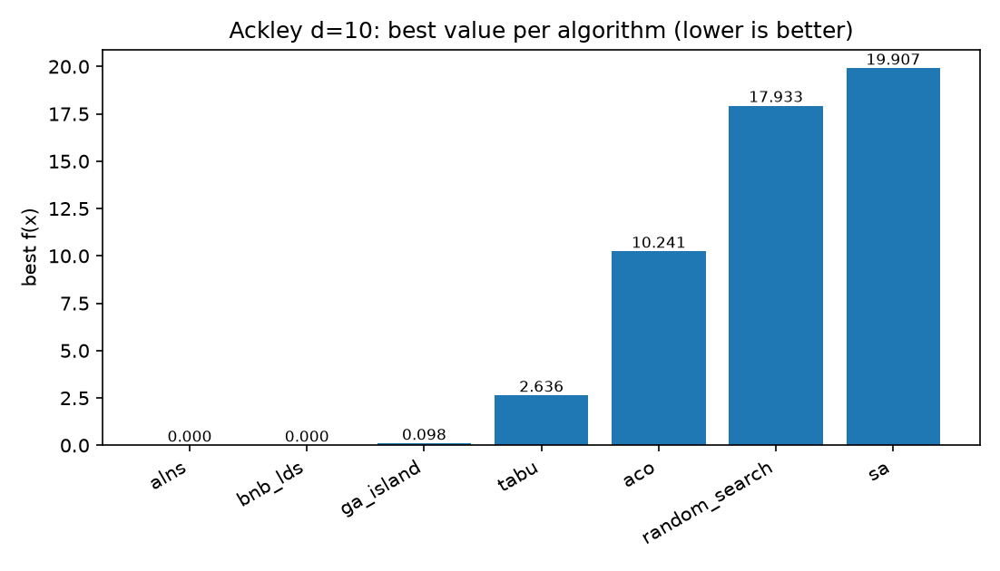

The figure shows the best value each algorithm reached over its three seeds,
sorted from best to worst. The spread is huge — from exactly 0 to almost 20 —
which mostly reflects how well each adaptation fits a continuous function,
not a universal ranking of the methods.

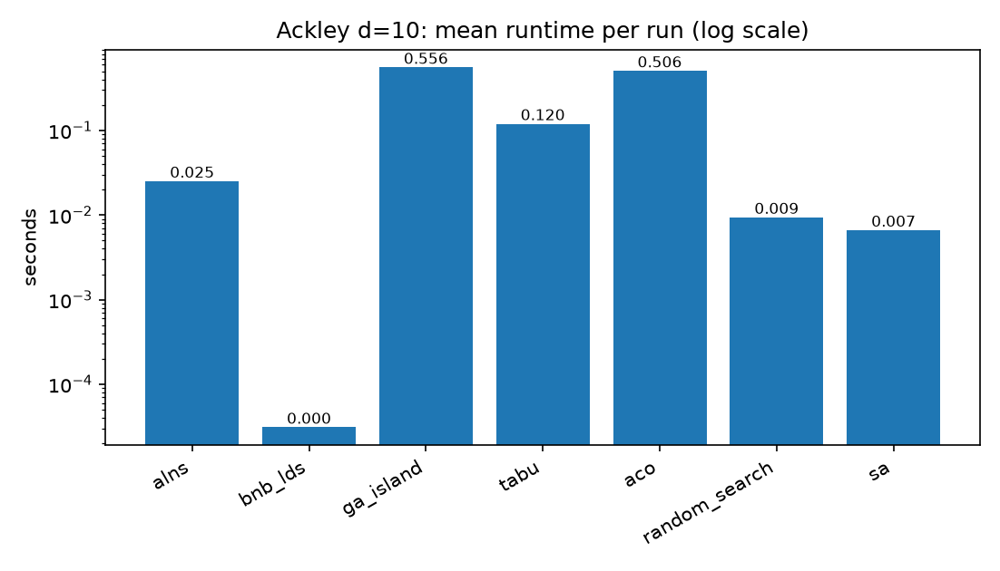

Runtime (log scale) shows the other side: SA and random search are almost
free, while ACO and GA-Island pay for population/colony bookkeeping. Note
that B&B/LDS looks instant only because its greedy zero-first bin order
finds the origin immediately and the search stops early.

Short analysis. ALNS and B&B/LDS reached 0.000000 (six decimals) on every
seed — but both benefit from knowing the optimum is at the origin: the ALNS
"toward zero" repair operator and the B&B/LDS bin ranking by distance to
zero point straight at it, so this says more about the adaptation than about
general optimization strength. GA-Island got close (≈0.1) without such a
hint. Tabu Search reached ≈2.6. ACO's coarse bins (10 per dimension) limit
its precision. SA with the untuned parameters (initial temperature 10, step
scale 1) actually ended worse than plain random search — an honest negative
result: 500 local Gaussian steps from a random corner of a 10-dimensional
box are simply not enough without parameter tuning.

## 4. Part A — CVRP

Official instances and best-known solutions (BKS):

| instance | BKS cost |
| --- | --- |
| P-n16-k8 | 450 |
| E-n22-k4 | 375 |
| A-n32-k5 | 784 |
| A-n80-k10 | 1763 |
| X-n101-k25 | 27591 |
| M-n200-k17 | 1275 |

The BKS values are used only to compute the gap percentage
(100 · (cost − BKS) / BKS); the algorithms never see them.

Best feasible result per instance (7 algorithms × 3 seeds = 21 rows per
instance; after the Stage 9-B2 repair **all 126 rows are feasible**):

| instance | BKS | best algorithm | best cost | best gap | feasible runs |
| --- | --- | --- | --- | --- | --- |
| P-n16-k8 | 450 | tabu | 451.95 | 0.43% | 21/21 |
| E-n22-k4 | 375 | alns | 375.28 | 0.07% | 21/21 |
| A-n32-k5 | 784 | alns | 787.08 | 0.39% | 21/21 |
| A-n80-k10 | 1763 | alns | 1834.01 | 4.03% | 21/21 |
| X-n101-k25 | 27591 | aco | 34613.14 | 25.45% | 21/21 |
| M-n200-k17 | 1275 | alns | 1351.43 | 5.99% | 21/21 |

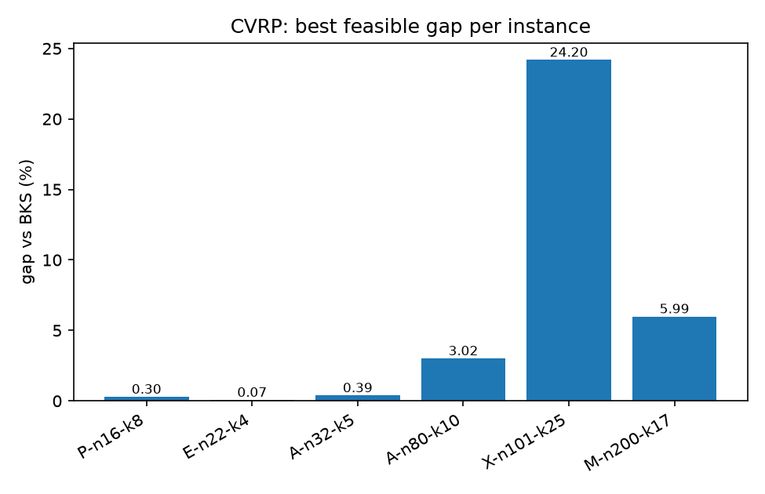

The picture is very clear: the three small instances end below half a
percent from the best known solutions, the two larger ones land at 4–6%,
and X-n101-k25 stands out at 25.45%. That column is not an algorithm bug —
it is a capacity-packing property of the instance, explained below. It
should not be read as "the algorithms failed"; it should be read as "this
instance leaves no room for the local moves these algorithms rely on".

Per algorithm (mean gap over all 18 runs each, plus where it was strongest
and weakest):

| algorithm | mean gap (all runs) | best instance | weakest instance |
| --- | --- | --- | --- |
| alns | 7.18% | E-n22-k4 (0.07%) | X-n101-k25 (27.08%) |
| aco | 7.74% | P-n16-k8 (0.43%) | X-n101-k25 (25.45%) |
| ga_island | 8.00% | P-n16-k8 (0.43%) | X-n101-k25 (25.74%) |
| tabu | 8.12% | P-n16-k8 (0.43%) | X-n101-k25 (26.82%) |
| sa | 8.63% | P-n16-k8 (1.55%) | X-n101-k25 (26.95%) |
| baseline | 8.70% | P-n16-k8 (2.65%) | X-n101-k25 (27.08%) |
| bnb_lds | 8.70% | P-n16-k8 (2.65%) | X-n101-k25 (27.08%) |

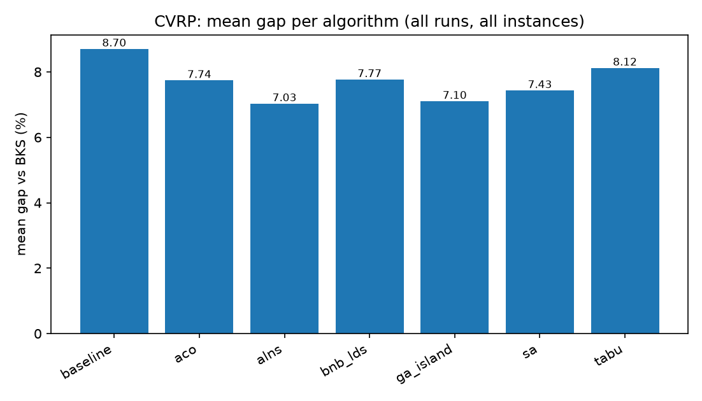

Averaged over all runs and instances, the ordering is ALNS < ACO <
GA-Island < Tabu < SA < baseline = B&B/LDS. The differences are small
(7.2%–8.7%) because the X instance dominates every mean; on the other five
instances the ordering is similar but the absolute gaps are much smaller.
B&B/LDS matching the baseline exactly is an honest result: within its node
and discrepancy limits it never found anything better than its starting
incumbent.

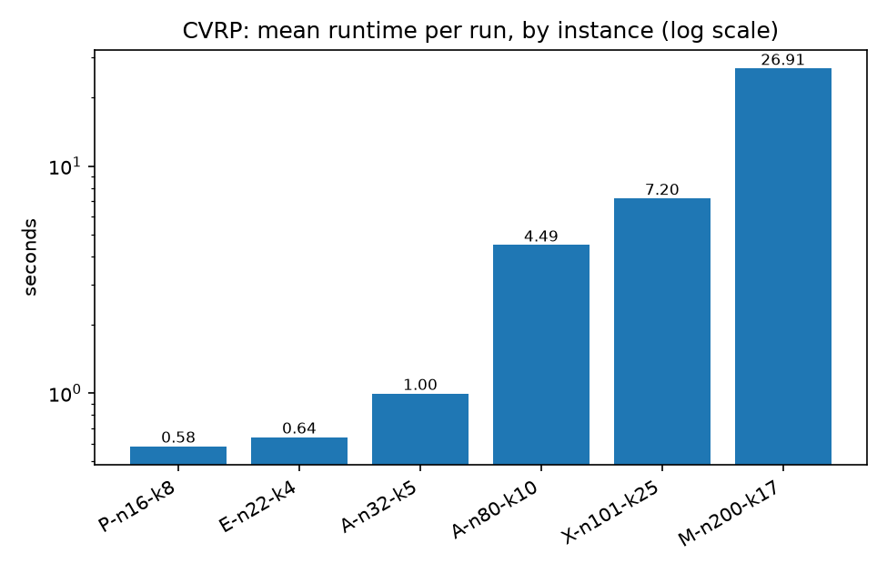

Mean runtime per run grows with instance size as expected (log scale). The
values are averages over all seven algorithms, so the cheap methods (SA,
baseline) pull the mean down; ACO alone accounts for most of the time on
the two largest instances.

### 4.1 Route visualizations

Route plots are included to check feasibility visually on top of the
validator checks: every tour must start and end at the black depot square,
and the route count in the title must not exceed the fleet size.

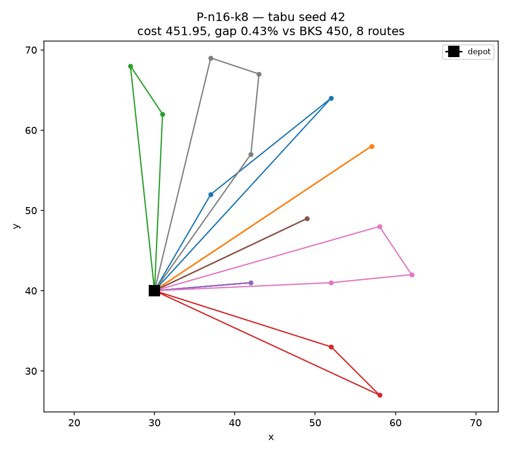

P-n16-k8 (tabu, seed 42, cost 451.95): eight short routes, each serving
only one or two customers — with capacity 35 and demands up to 30-plus,
most vehicles can take very little, which is why the instance needs all
eight vehicles despite having only 15 customers.

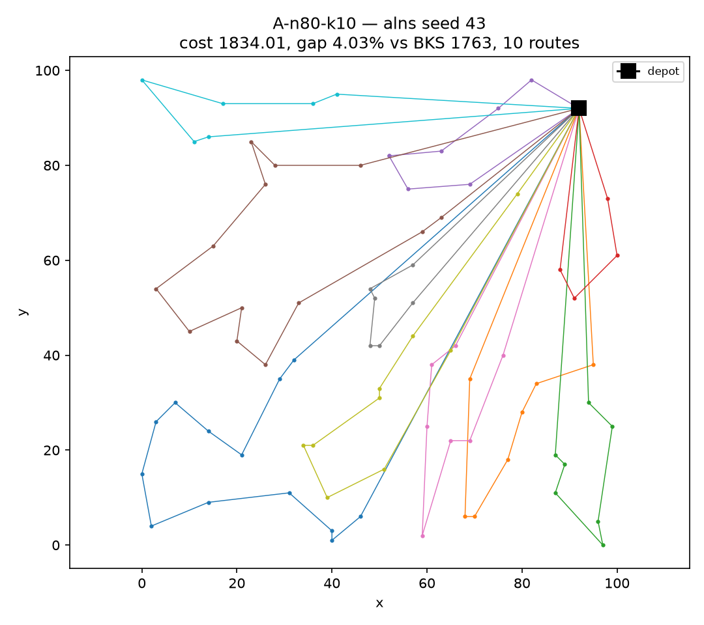

A-n80-k10 (alns, seed 43, cost 1834.01): ten routes fanning out of the
depot in clean geographic sectors. Some crossings between neighboring
routes remain — visual evidence of the remaining 4% gap that in-route 2-opt
alone cannot remove.

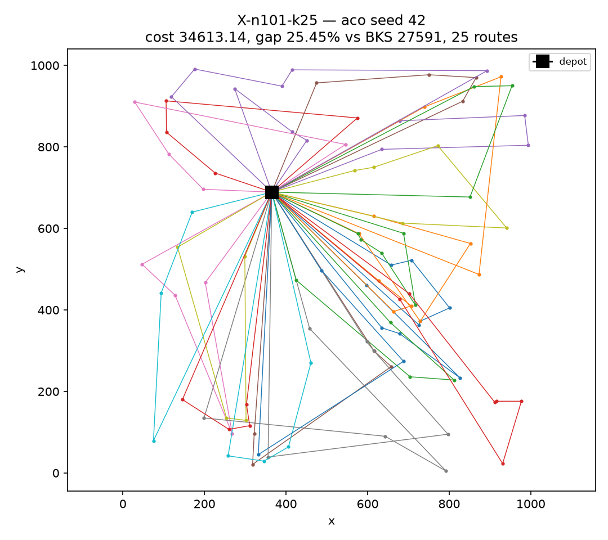

X-n101-k25 (aco, seed 42, cost 34613.14): the plot is dense because the
instance is large (100 customers) and extremely tight (25 nearly-full
routes), so it is harder to inspect visually — long criss-crossing legs are
exactly what a load-driven packing looks like when geometry has to take
second place to capacity.

### 4.2 Convergence behavior

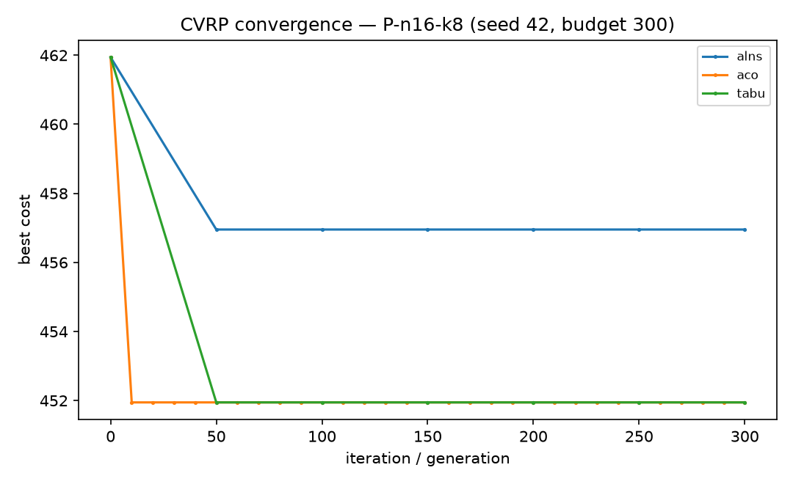

On the small instance every method starts from the repaired baseline
(461.94) and improves quickly: ACO reaches 451.95 within its first ten
iterations, Tabu follows by iteration 50, ALNS settles slightly higher at
456.95 for this seed. After that the curves are flat — the instance is
essentially solved as far as these operators can take it.

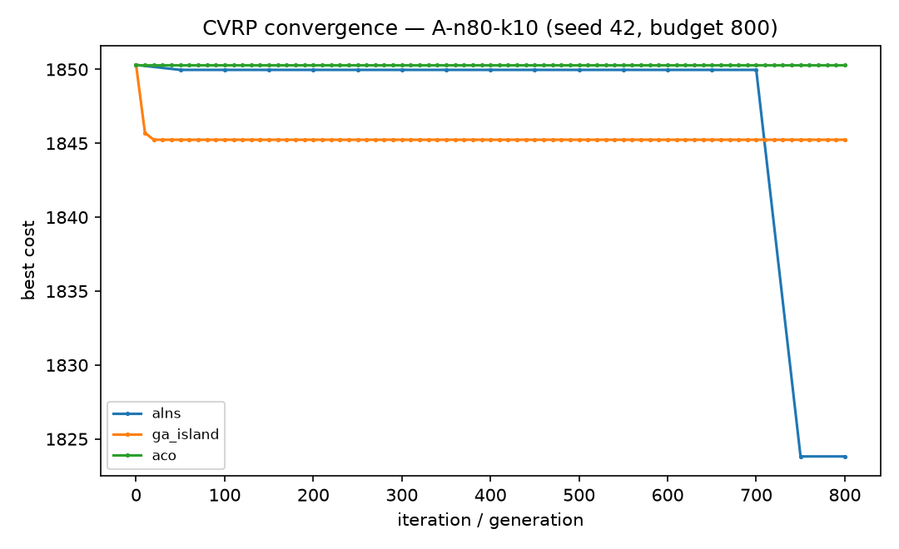

On A-n80-k10 the honest picture is that most of the quality comes from the
multi-stage baseline itself (1850.30): ALNS shaves a few units early and
then plateaus, while GA-Island and ACO never beat the baseline for this
seed. The strong start compresses the visible improvement — the y-axis
spans only a few cost units.

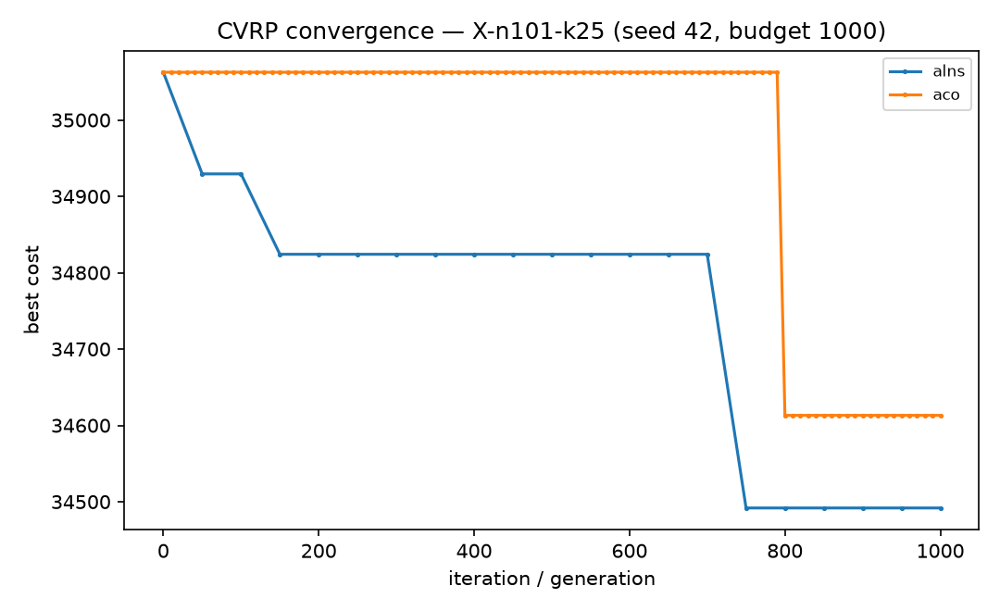

On X-n101-k25 the curves confirm the packing story: after the subset-sum
repair produces a feasible start, ALNS cannot improve it at all (its
capacity-feasible repairs keep failing in the 3-unit-slack packing), while
ACO's constructive ants find a slightly better packing (34613 vs 35062).
Neither gets anywhere near the BKS — improvement is limited after feasible
packing, as discussed above.

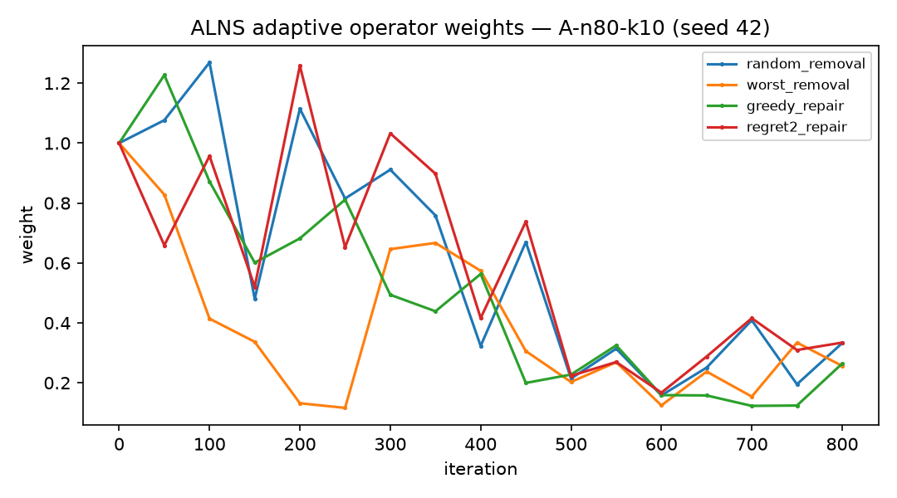

The ALNS adaptive layer is visibly working: operator weights move away from
their initial 1.0 within the first ~50 iterations and then stabilize once
improvements dry up. The weights drift toward the reject-score floor
because late iterations rarely produce accepted candidates — expected
behavior for a run that has already converged, not a malfunction.

Honest note on X-n101-k25: its total demand is 5147 while the total fleet
capacity is 25 × 206 = 5150 — only 3 units of slack over 25 routes, so
almost every route must be loaded completely full. Clarke-Wright needed 28
routes there, and a subset-sum packing repair (Section 5) was required just
to reach feasibility. That packing ignores geometry, and with nearly zero
capacity slack the usual local moves (relocate, cross-route swap) are
almost always capacity-infeasible, so the metaheuristics could barely
improve the start. The 25.45% gap is real and reported as such.

## 5. Multi-stage CVRP Heuristic

The baseline heuristic runs in five stages:

1. **Construction** with Clarke-Wright savings (merge route ends by
   descending saving under the capacity limit).
2. **2-opt** inside each route (reverse inner segments while improving).
3. **Relocate** between routes (move single customers while improving).
4. **Vehicle-count repair**: first empty surplus routes and reinsert their
   customers at cheapest feasible positions; if that fails, deterministic
   rebuilds (cheapest insertion, best-fit packing, sweep by polar angle);
   as a last resort a subset-sum packing that fills vehicles one at a time
   as full as possible over the integer demands — this is what makes
   X-n101-k25 feasible.
5. **Final validation** — a failed repair is returned as feasible=False
   with errors, never hidden.

Why the repair stage was necessary: Clarke-Wright merges routes only while
the merge is profitable, so on instances with a tight fleet it can stop
with more routes than vehicles exist. This actually happened twice in the
final runs — P-n16-k8 (9 routes for 8 vehicles) and X-n101-k25 (28 routes
for 25). Without the repair, every algorithm that starts from the baseline
would inherit an infeasible incumbent, which is exactly what the first
final run showed before stages 8-B2/9-B2. The subset-sum packing below is
the piece that finally made X-n101-k25 feasible:

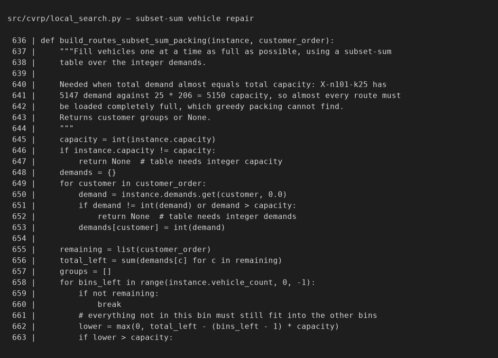

The idea is simple to state: when total demand almost equals total fleet
capacity, almost every vehicle must leave completely full, so the repair
fills vehicles one at a time with a subset of customers whose demands sum
as close to the capacity as possible (a small dynamic-programming table
over the integer demands), with a lower bound making sure the remaining
customers still fit into the remaining vehicles.

Complexity: everything here is heuristic, not exact. One 2-opt pass over a
route of length L costs O(L²) route evaluations and passes repeat until no
improvement. The relocate pass scans all customer/position pairs, roughly
O(n²) per pass. The repair adds packing work (the subset-sum table is
O(n · capacity) per vehicle) but guarantees the route count fits the fleet,
which turned out to be essential on two of the six official instances.

## 6. CVRP Algorithms

All six start from the multi-stage baseline solution, share one random
relocate/swap/2-opt neighborhood where applicable, and were run with the
same per-instance budget and timeout for a fair comparison.

### 6.1 Simulated Annealing

Full solutions as states; one random neighbor per iteration; accept
improvements always and worse candidates with probability exp(-delta/T),
T multiplied by 0.995 per iteration. SA improved the small instances (best
P-n16-k8 gap 1.55%) but with this untuned schedule it mostly stayed near
the baseline on the larger ones (mean gap 8.63%).

### 6.2 Tabu Search

Samples 40 candidates per iteration from the shared neighborhood, forbids
recently visited solutions via a customer-sequence signature (FIFO tenure
30), with aspiration on a new global best. Tied for the best P-n16-k8
result (0.43%) and was solid on the small instances; mean gap 8.12%.

### 6.3 Ant Colony Optimization

Ants build routes customer by customer with probability proportional to
pheromone^α · (1/distance)^β under the capacity limit, light 2-opt per ant,
evaporation plus deposits on the iteration and global best. ACO produced
the best feasible X-n101-k25 result (25.45%) — its constructive nature
sidesteps the frozen-local-moves problem there — at the price of the highest
runtime (mean 32.8 s per run).

### 6.4 GA Island Model

Giant-tour chromosomes (customer permutations) split into routes by a
capacity-aware scan; OX crossover, swap/inversion mutation, tournament
selection, elitism 1; two islands with ring migration every 20 generations.
Solid mid-field (mean gap 8.00%), best on P-n16-k8 (0.43%).

### 6.5 ALNS

Destroy operators (random and worst removal) and repair operators (greedy
and regret-2 insertion) chosen by adaptive weights, with simulated-annealing
acceptance. ALNS was the strongest method overall in these runs: best
feasible result on four of six instances (E-n22-k4 0.07%, A-n32-k5 0.39%,
A-n80-k10 4.03%, M-n200-k17 5.99%) and the lowest mean gap (7.18%) at a
moderate mean runtime of 5.2 s.

### 6.6 Branch-and-Bound / LDS

A time-limited search over customer insertion decisions (hardest customers
first), where taking the k-th cheapest insertion costs k discrepancy, with
a partial-cost bound against the incumbent. It is exact-inspired, not a
full exact solver for these sizes: within the node/discrepancy limits it
never beat the baseline incumbent on any official instance, so its rows
match the baseline (mean gap 8.70%). It proved useful mainly as a
correctness reference.

## 7. Ackley Adaptations

SA and Tabu Search are natural continuous methods here (Gaussian steps; a
tabu list of rounded points). GA-Island and ALNS operate directly on
continuous vectors (blend crossover and Gaussian mutation; dimension-wise
destroy and repair). ACO and B&B/LDS are honest discretizations (pheromone
over bins per dimension; limited-discrepancy search over bin choices) — the
canonical versions of these methods are combinatorial, and the report does
not claim otherwise. Random search is only a sanity baseline. The results
in Section 3 reflect exactly this: the methods whose adaptation points
toward the origin (ALNS's toward-zero repair, B&B/LDS's zero-first bin
order) reached it, the general-purpose ones (GA-Island, Tabu) got close,
and untuned SA performed worst.

## 8. Part B — Rush Hour with GP and GEP

A* solves 6×6 Rush Hour boards with g = number of moves and a pluggable
heuristic h. GP and GEP evolve h as expressions over three board features —
distance of the red car to the exit, number of blocking cars, number of
free exit cells — plus small constants, with protected operators
(+, -, *, /, min, max, abs, neg, log). Fitness strongly rewards solved
puzzles (10000 each) and penalizes expanded nodes, solution cost, timeouts
and node-cap hits. Every evaluation runs under the safety caps from
Section 2.3.

GP uses expression trees with subtree crossover and mutation. GEP is a
separate framework: a linear genome with a head (functions or terminals)
and a tail (terminals only), decoded as a Karva K-expression; its operators
are point mutation and one-/two-point crossover on the flat gene string.
The decoder is the heart of GEP — it reads the linear genome left to right
and attaches children level by level, ignoring leftover symbols:

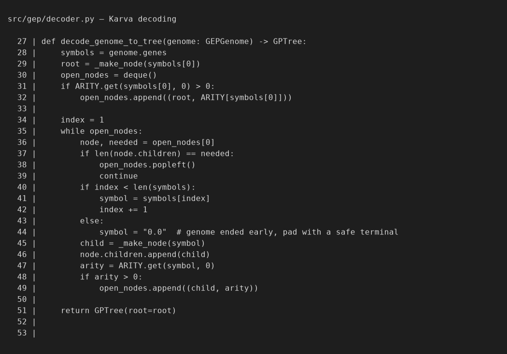

Final comparison (train and eval sets of 4 puzzles each, 20 generations,
population 30, seeds 42–44), from `raw/gp_gep_comparison_runs.csv`:

| algorithm | seed | eval fitness | solved | expanded | cost | best expression |
| --- | --- | --- | --- | --- | --- | --- |
| gp | 42 | 39956 | 4/4 | 4 | 4 | min((min(blocking, blocking) * (distance - 0)), ((distance * blocking) / (blocking / distance))) |
| gp | 43 | 39956 | 4/4 | 4 | 4 | (blocking - min((2 / neg((1 + free))), blocking)) |
| gp | 44 | 39956 | 4/4 | 4 | 4 | max((log(distance) / neg(1)), max(min(5, blocking), (blocking * distance))) |
| gep | 42 | 39956 | 4/4 | 4 | 4 | (5 * blocking) |
| gep | 43 | 39956 | 4/4 | 4 | 4 | ((((1 + distance) * blocking) + 0.5) + 1) |
| gep | 44 | 39956 | 4/4 | 4 | 4 | (((blocking * 1) / (blocking - 0.5)) + (abs(2) - free)) |

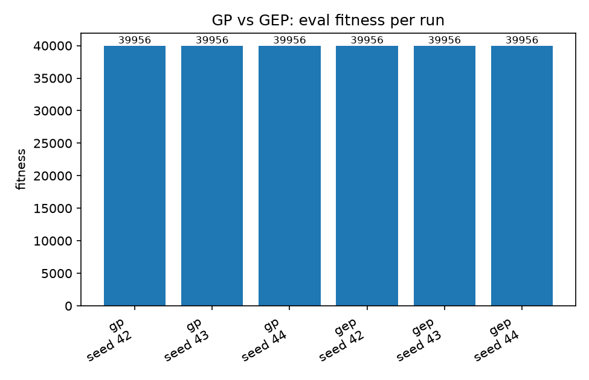

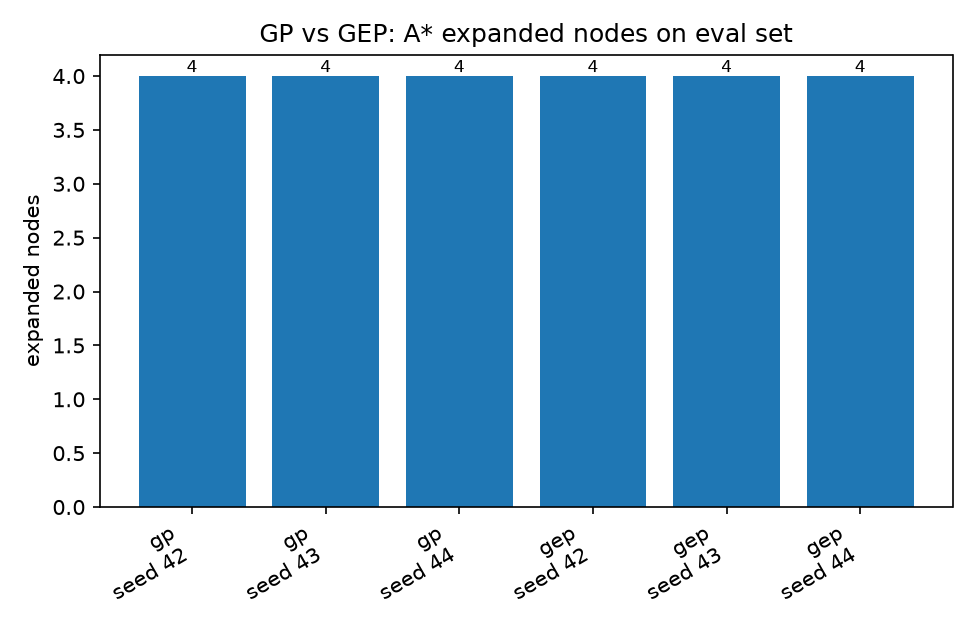

The two charts make the "tie" visible: identical fitness (39956) and
identical A* effort (4 expanded nodes total) in every run of both methods.
What this comparison actually means: on this evaluation set the evolved
heuristics guide A* essentially perfectly, so quality cannot separate GP
from GEP here — the interesting differences are the shape of the evolved
expressions and the evolution time. What it does not mean: that GP and GEP
are equal in general. Four small puzzles are simply not enough pressure;
a harder puzzle set would likely start separating the methods.

Summary. Every run (both methods, all seeds) solved 4/4 evaluation puzzles
with only 4 expanded nodes total, giving the identical best fitness 39956 —
the evaluation set is too easy to separate the methods on quality.
Expression diversity is 1.00 for both (all best expressions differ across
seeds), and GEP's genome diversity is also 1.00. Evolution time slightly
favored GEP (≈0.7–0.9 s per run vs ≈1.1–1.4 s for GP), and GEP's best
expressions are visibly shorter (e.g. `(5 * blocking)`). With only 4 tiny
puzzles these are observations, not general conclusions.

## 9. Results

The main tables and figures are in Sections 3 (Ackley), 4 (CVRP) and 8
(GP/GEP); the committed report figures live under `report/figures/`. The
raw per-run rows live under `results/final_experiments/raw/` (126 CVRP
rows, 21 Ackley rows, 6 GP/GEP rows), the aggregated tables under
`results/final_experiments/summary/`, and additional generated assets under
`results/final_experiments/report_assets/`. The execution manifest
(`final_execution_manifest.json`) records what ran, with which budgets, and
how long it took.

## 10. Analysis and Discussion

- **CVRP pattern.** Gaps grow with instance size: under 0.5% on the three
  small instances, ~4–6% on A-n80-k10 and M-n200-k17. ALNS was the most
  consistent method; ACO was the most expensive but handled the tight X
  instance best.
- **X-n101-k25.** With 3 units of total capacity slack, feasibility is a
  bin-packing problem and quality improvement is nearly frozen: any
  relocate overfills a route. Repairing to feasibility cost geometry
  (packing ignores coordinates), leaving a 25.45% gap. Improving this
  would need capacity-aware compound moves (e.g. ejection chains), which
  were out of scope.
- **Ackley.** The warm-up separated the methods clearly, but part of that
  separation comes from how each was adapted (Section 7). Untuned SA losing
  to random search is a useful reminder that parameter choices matter as
  much as the algorithm name.
- **GP vs GEP.** Equal quality on this small benchmark; GEP was somewhat
  faster and produced more compact expressions; GP trees were larger. Both
  frameworks are genuinely different representations, not renames.
- **Runtime vs quality.** ACO bought its X result with ~33 s mean runtime;
  ALNS delivered the best average quality at ~5 s; SA is nearly free but
  weakest. B&B/LDS spent its budget without beating the incumbent.
- **Limitations.** One fixed budget/timeout profile per instance, three
  seeds, no tuning, and a small Rush Hour puzzle set — the comparisons hold
  for this setup only.

## 11. Complexity and Practical Considerations

- **Feasibility checking** is O(n) per solution and is run on every
  candidate the metaheuristics accept, plus once on every final result —
  the cost is small compared to neighborhood evaluation and it caught real
  bugs (route-count violations) that pure cost comparison would hide.
- **Neighborhood costs.** The shared relocate/swap/2-opt neighborhood costs
  O(n) per sampled neighbor (copy + cost); Tabu's 40 candidates per
  iteration make it ~40× SA per iteration, which matches the observed
  runtimes.
- **Stochastic variance.** Three seeds per configuration; the summary CSVs
  report mean and standard deviation. The seeds are fixed in the plan, so
  every row can be regenerated exactly.
- **Timeouts and fairness.** All algorithms get the same timeout on the
  same instance, so slower-per-iteration methods are not silently given
  more work. Budgets differ per algorithm in meaning (iterations vs
  generations vs nodes), which is why the timeout is the binding fairness
  control on the large instances.
- **No optimality claims.** Everything here is heuristic or time-limited;
  the gaps against BKS quantify exactly how far the results are from the
  best known solutions.

## 12. Use of AI Tools

AI tools were used as coding and debugging assistants during the project.
The final code and this report were reviewed and understood by the student.
Any generated code was tested and adjusted through the project's test suite
and staged workflow.

## 13. Reproducibility

- Python 3.12.3, dependencies via `pip install -r requirements.txt`
  (numpy, matplotlib, pandas, pytest).
- Place the six official CVRPLIB files under `data/official_cvrp/` and
  verify with `python scripts/check_official_cvrp_data.py --strict`.
- Smoke check: `python scripts/run_smoke_suite.py --output-dir results/smoke_suite`
- Print/validate the final plan:
  `python scripts/print_final_experiment_plan.py --require-official-data`
- Full final run (resumable): `python scripts/run_final_experiments.py`
- Report figures: `python scripts/generate_report_figures.py`, plus
  `python scripts/generate_route_visualizations.py` and
  `python scripts/generate_convergence_figures.py`, then
  `python scripts/export_report_pdf.py` for this PDF
- Report facts: `python scripts/extract_report_numbers.py`
- Small evidence snapshots of the result files cited by this report are
  committed under `report/evidence/` (summaries, GP/GEP runs, execution
  manifest). The full generated outputs stay under
  `results/final_experiments/` locally and are not committed to Git, and
  the official `.vrp` files are user-provided data that is also kept out of
  the repository.

The final runner is what makes the experiments reproducible in practice:
it validates the plan and the official data before anything runs, executes
each part through the same Python functions the tests use, writes one CSV
row per run with its seed/budget/timeout, and skips already-finished raw
files — when the vehicle-count repair changed, only X-n101-k25 had to be
rerun while the other five instances were reused untouched:

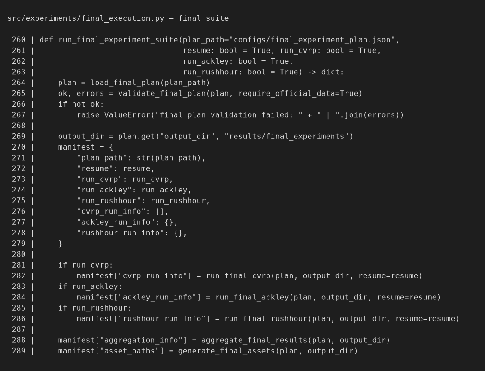

The submission audit output below is the real terminal output of the audit
script on this repository — 28 checks covering files, row counts,
feasibility, the report, and forbidden artifacts:

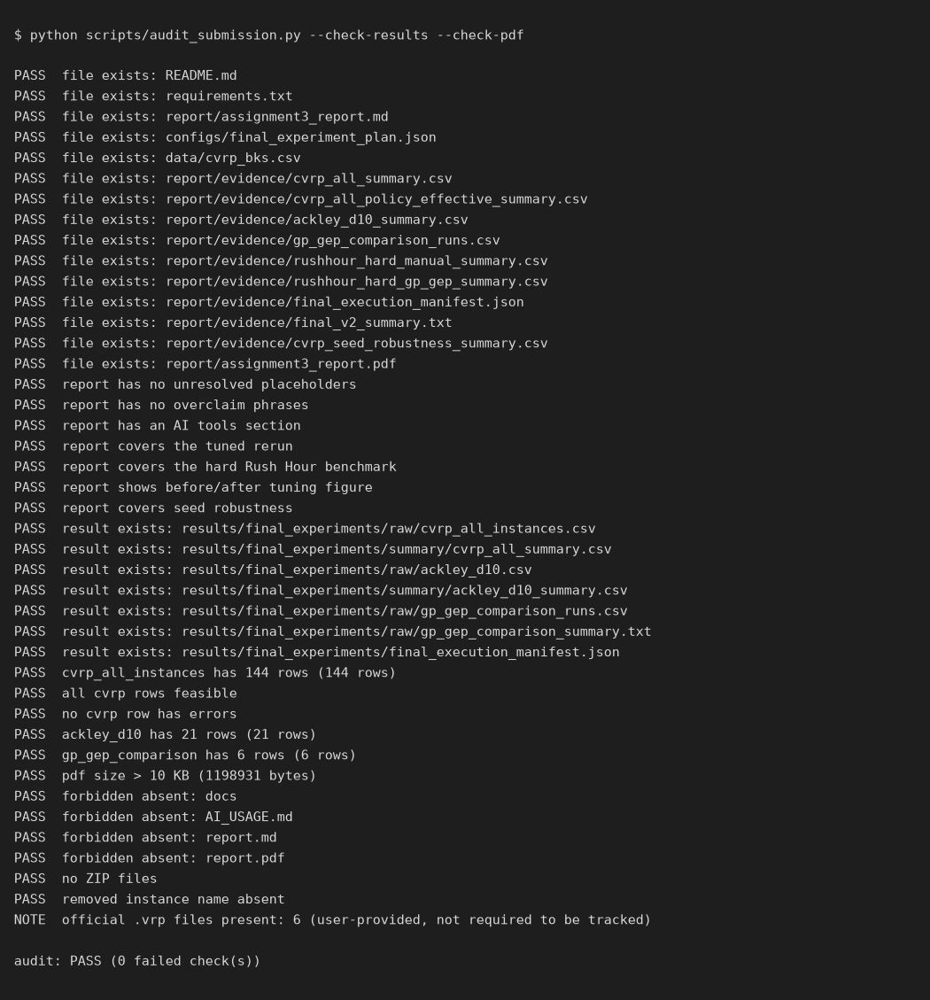

And the extracted report numbers, printed straight from the final CSVs
(the same numbers used in the tables above):

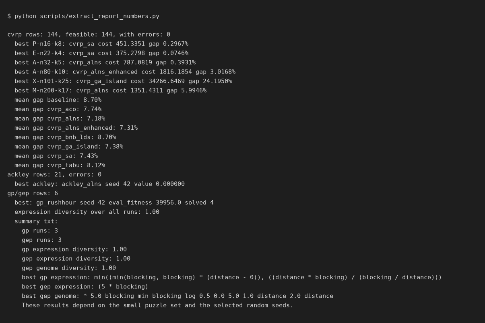

## 14. Conclusion

The implementation covers everything the assignment asks for: the six
required search algorithms on both the Ackley warm-up and the six official
CVRP instances, an explicit multi-stage CVRP heuristic with an honest
feasibility-repair story, and separate GP and GEP frameworks for evolving
Rush Hour heuristics evaluated through A*. After the vehicle-count repair
work, all 126 final CVRP rows are feasible; gaps are small on the small
instances (0.07–0.43%), moderate on the large ones (4–6%), and large on the
capacity-tight X-n101-k25 (25.45%), which is reported as a real limitation
rather than smoothed over. On Ackley, the adapted ALNS and B&B/LDS reached
the optimum while untuned SA did not beat random search. GP and GEP both
solved the full Rush Hour evaluation set with identical fitness, with GEP
slightly faster and more compact on this small benchmark. The main open
improvements are capacity-aware compound moves for tight CVRP instances,
parameter tuning for SA, and a harder Rush Hour puzzle set.
