# Assignment 3 Report

Course 203.3630 — Artificial Intelligence Lab.

All numbers in this report come from the generated result files under
`results/final_experiments/` (final run with seeds 42, 43, 44 from
`configs/final_experiment_plan.json`). Nothing was filled in by hand without
a matching CSV row; `scripts/extract_report_numbers.py` prints the same
facts for checking.

## 1. Introduction

The assignment has two parts. Part A asks for six search algorithms
(Simulated Annealing, Tabu Search, Ant Colony Optimization, a Genetic
Algorithm with an Island Model, Adaptive Large Neighborhood Search, and
Branch & Bound / Limited Discrepancy Search), first validated on the
continuous Ackley function as a warm-up and then compared on six official
CVRP benchmark instances, together with an explicit multi-stage heuristic.
Part B asks for generative AI: evolving Rush Hour heuristic functions with
both Genetic Programming (GP) and Gene Expression Programming (GEP), where
every candidate heuristic is judged by actually running A* with it.

All stochastic runs use the fixed seeds 42, 43 and 44 from the final
experiment plan, so every number below is reproducible. This 3-seed final
run is the canonical source of every headline table in this report; the
only 8-seed numbers are in the separate robustness study (Section 4.3,
seeds 42–49), which is labeled as such and is not the source of any
headline value.

The final version of the project contains four layers on top of the first
complete run: a controlled tuning pass (validated on all six instances
before acceptance) that improved SA, GA-Island and ALNS; a B&B/LDS
small-instance mode; a local-search performance pass (O(1) delta 2-opt)
followed by advanced local-search moves (inter-route swap, Or-opt, 2-opt*,
candidate-list neighborhoods) gated to the larger instances; and, on Part
B, a measured 14-puzzle hard Rush Hour benchmark plus an 8-seed CVRP
robustness analysis and the optional no-A* bonus: GP/GEP evolved as direct
planners (Section 8.2). The final rerun with all accepted settings improved
the best CVRP gaps to 2.95% on A-n80-k10, 23.01% on X-n101-k25 and 5.51%
on M-n200-k17 with no project-best regressions, and the Ackley results
were left unchanged. All numbers in this report come from that final
rerun.

## 2. Implementation Overview

### 2.1 Project structure

The code is a plain Python package: `src/common/` (timing), `src/ackley/`
(function + the six adaptations), `src/cvrp/` (model, parser, cost,
validation, baseline) with `src/cvrp/solvers/` (the six algorithms),
`src/rushhour/` (board, A*, safe evaluator, GP/GEP comparison), `src/gp/`
and `src/gep/` (separate frameworks), and `src/experiments/` (runners,
summaries, report assets). `scripts/` holds the CLI entry points and
`tests/` the pytest suite (343 tests at the time of the final run).

### 2.2 Reproducibility and command-line interface

Every run takes its inputs from CLI arguments — instance paths, seeds,
budgets and timeouts are never hardcoded. Each experiment row is written to
CSV with its seed, budget, timeout, costs, feasibility, errors and timing.
The final settings live in `configs/final_experiment_plan.json` and the
runner `scripts/run_final_experiments.py` is resumable (finished raw CSVs
are skipped on a rerun).

### 2.3 Validation and safety checks

Every CVRP solution is validated: routes start and end at the depot, no
customer is missing or duplicated, capacity is respected, and the number of
used routes must not exceed the vehicle count. Rows report `feasible` and
the exact validation errors — nothing is silently fixed. Rush Hour
heuristic evaluation runs A* under a node cap, a per-puzzle time cap and a
total time budget, and an exception inside a candidate heuristic is
recorded as a failed puzzle instead of crashing the run.

## 3. Part A — Ackley Function

The Ackley function for d dimensions:

f(x) = -a * exp(-b * sqrt((1/d) * sum(x_i^2)))
       - exp((1/d) * sum(cos(c * x_i))) + a + e

with a = 20, b = 0.2, c = 2*pi, dimension d = 10, bounds
x_i in [-32.768, 32.768], and the known optimum f(0, ..., 0) = 0.

Final results (3 seeds per algorithm, budget 500, timeout 60 s), from
`summary/ackley_d10_summary.csv`:

| algorithm | runs | best_value | mean_best_value | std_best_value | mean_dist_from_origin | mean_elapsed (s) |
| --- | --- | --- | --- | --- | --- | --- |
| ackley_alns | 3 | 0.000000 | 0.000000 | 0.000000 | 0.000000 | 0.025 |
| ackley_bnb_lds | 3 | 0.000000 | 0.000000 | 0.000000 | 0.000000 | 0.000 |
| ackley_ga_island | 3 | 0.098 | 0.100 | 0.002 | 0.063 | 0.556 |
| ackley_tabu | 3 | 2.636 | 3.018 | 0.359 | 1.466 | 0.120 |
| ackley_aco | 3 | 10.241 | 11.763 | 1.406 | 11.187 | 0.506 |
| random_search | 3 | 17.933 | 18.320 | 0.481 | 30.278 | 0.009 |
| ackley_sa | 3 | 19.907 | 20.041 | 0.118 | 46.706 | 0.007 |

The figure shows the best value each algorithm reached over its three seeds,
sorted from best to worst. The spread is huge — from exactly 0 to almost 20 —
which mostly reflects how well each adaptation fits a continuous function,
not a universal ranking of the methods.

Runtime (log scale) shows the other side: SA and random search are almost
free, while ACO and GA-Island pay for population/colony bookkeeping. Note
that B&B/LDS looks instant only because its greedy zero-first bin order
finds the origin immediately and the search stops early.

Short analysis. ALNS and B&B/LDS reached 0.000000 (six decimals) on every
seed — but both benefit from knowing the optimum is at the origin: the ALNS
"toward zero" repair operator and the B&B/LDS bin ranking by distance to
zero point straight at it, so this says more about the adaptation than about
general optimization strength. GA-Island got close (≈0.1) without such a
hint. Tabu Search reached ≈2.6. ACO's coarse bins (10 per dimension) limit
its precision. SA with the untuned parameters (initial temperature 10, step
scale 1) actually ended worse than plain random search — an honest negative
result: 500 local Gaussian steps from a random corner of a 10-dimensional
box are simply not enough without parameter tuning.

## 4. Part A — CVRP

Official instances and best-known solutions (BKS):

| instance | BKS cost |
| --- | --- |
| P-n16-k8 | 450 |
| E-n22-k4 | 375 |
| A-n32-k5 | 784 |
| A-n80-k10 | 1763 |
| X-n101-k25 | 27591 |
| M-n200-k17 | 1275 |

The BKS values are used only to compute the gap percentage
(100 · (cost − BKS) / BKS); the algorithms never see them.

The final run uses tuned settings accepted after a separate validation
pass: SA runs 50× more (very cheap) iterations with a slower cooling
schedule and a higher start temperature; GA-Island uses population 30 with
mutation 0.3; and ALNS gained extra destroy/repair operators (Shaw-style
related removal, full-route removal, segment removal, regret-3 insertion).
Because the enhanced ALNS regressed on M-n200-k17 during validation, the
final rerun executes **both** ALNS variants (144 raw rows in total: 8
algorithm rows × 6 instances × 3 seeds) and the reported "alns" result
follows a rule declared *before* the rerun: enhanced everywhere except
M-n200-k17, which uses the basic variant. Nothing is cherry-picked after
the fact and both variants' raw rows are kept.

On top of the tuning, the final run includes a two-step local-search
upgrade. First, 2-opt was rewritten with O(1) delta evaluation (only the
four changed edges are priced per candidate move instead of recomputing
the whole route) — proven byte-identical to the old implementation by
tests, so it changed runtime, not results. Second, that headroom paid for
**advanced moves**: inter-route relocate and swap, Or-opt (segment
relocate of length 2–3), and 2-opt* (cross-route tail exchange), combined
into an intensification pass that ALNS applies to new best solutions and
GA-Island applies to its elite every 10 generations (with the polished
chromosome reinjected). Neighborhoods can be restricted to precomputed
k-nearest candidate lists (k = 10 accepted; k = 10/20/full produced
identical solutions in validation). Because validation showed a small
regression on the tiny instances (P-n16-k8 0.30→0.39), the advanced pass
is **gated by instance size** — it only activates for instances with at
least 60 customers, a customer-count threshold like the B&B small-instance
mode, not an instance name list — so the small instances keep their
already-validated behavior exactly.

Best feasible result per instance (all 144 rows feasible):

| instance | BKS | best algorithm | best cost | best gap | before tuning + advanced |
| --- | --- | --- | --- | --- | --- |
| P-n16-k8 | 450 | sa (tuned) | 451.34 | 0.2967% | 0.43% |
| E-n22-k4 | 375 | sa (tuned) | 375.28 | 0.0746% | 0.07% |
| A-n32-k5 | 784 | alns | 787.08 | 0.3931% | 0.39% |
| A-n80-k10 | 1763 | alns (enhanced + advanced) | 1814.95 | 2.9466% | 4.03% |
| X-n101-k25 | 27591 | ga_island (tuned + advanced) | 33938.66 | 23.0063% | 25.45% |
| M-n200-k17 | 1275 | alns (basic + advanced) | 1345.30 | 5.5139% | 5.99% |

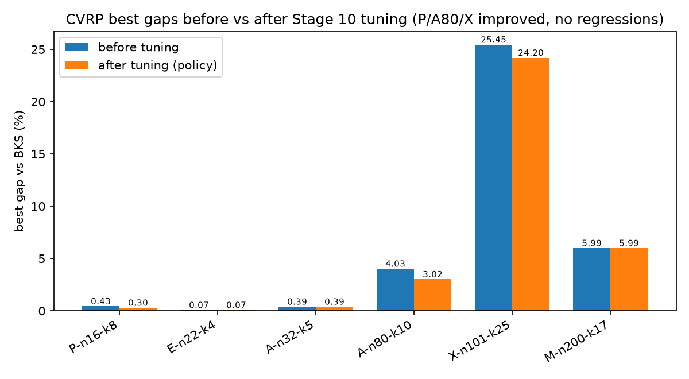

The before/after chart shows the combined effect of tuning plus the
advanced moves: P-n16-k8 (0.43→0.30), A-n80-k10 (4.03→2.95), X-n101-k25
(25.45→23.01) and M-n200-k17 (5.99→5.51) improved, E-n22-k4 and A-n32-k5
stayed exactly where they were, and no instance got worse. The X-n101-k25
column still stands out; that is a capacity-packing property of the
instance, explained below, not an algorithm bug.

Per algorithm (mean of best-of-seeds gaps over the six instances, policy
view):

| algorithm | mean best gap | beats baseline on |
| --- | --- | --- |
| alns (policy + advanced) | 5.851% | 6/6 instances |
| sa (tuned) | 6.740% | 4/6 |
| ga_island (tuned + advanced) | 6.958% | 6/6 |
| aco | 7.558% | 4/6 |
| bnb_lds (small-instance mode) | 7.765% | 2/6 |
| tabu | 8.092% | 5/6 |
| baseline | 8.703% | — |

ALNS keeps the lowest mean best gap (5.85%), and with the advanced pass
GA-Island now also beats the multi-stage baseline on all six instances —
its memetic polish finally moved it off the baseline on A-n80-k10 (4.66%
vs the baseline 4.95%) and it holds the overall best X-n101-k25 result.
The tuned SA remains the biggest single tuning mover (8.50% to 6.74%
purely by spending its unused time budget on more iterations with a longer
schedule). One honest caveat: the advanced pass changed the enhanced ALNS
trajectory on X-n101-k25 for the worse (25.01→25.88), which is why the
ALNS mean ticked up from 5.80% to 5.85% even though ALNS improved on
A-n80-k10 and M-n200-k17 — the regression is disclosed in Section 4.4.
B&B/LDS keeps its small-instance mode results: it ties the project-best on
P-n16-k8 (0.30%) and E-n22-k4 (0.07%) in about a second each — but on the
four larger instances it still returns its starting incumbent, which is
stated as-is (overall mean 7.77%, beating the baseline on 2/6).

Mean runtime per run grows with instance size as expected (log scale). The
values are averages over all seven algorithms, so the cheap methods (SA,
baseline) pull the mean down; ACO alone accounts for most of the time on
the two largest instances.

### 4.1 Route visualizations

Route plots are included to check feasibility visually on top of the
validator checks: every tour must start and end at the black depot square,
and the route count in the title must not exceed the fleet size.

P-n16-k8 (tuned SA, seed 42, cost 451.34): eight short routes, each
serving only one or two customers — with capacity 35 and demands up to
30-plus, most vehicles can take very little, which is why the instance
needs all eight vehicles despite having only 15 customers.

A-n80-k10 (enhanced ALNS with the advanced pass, seed 44, cost 1814.95):
ten routes fanning out of the depot in clean geographic sectors. A few
crossings between neighboring routes remain — visual evidence of the
remaining ~2.9% gap that even the inter-route moves cannot remove within
the budget.

X-n101-k25 (tuned GA-Island with the advanced pass, seed 43, cost
33938.66): the plot is dense
because the instance is large (100 customers) and extremely tight (25
nearly-full routes), so it is harder to inspect visually — long
criss-crossing legs are exactly what a load-driven packing looks like when
geometry has to take second place to capacity.

### 4.2 Convergence behavior

On the small instance every method starts from the repaired baseline
(461.94) and improves quickly: ACO and Tabu reach 451.95 within the first
50 iterations, and the enhanced ALNS goes one step further to 451.34 for
this seed (the advanced pass is gated off here — 15 customers is far below
the 60-customer threshold). After that the curves are flat — the instance
is essentially solved as far as these operators can take it.

On A-n80-k10 most of the quality still comes from the multi-stage baseline
(1850.30), but with the advanced intensification the enhanced ALNS pulls
away to 1823.82 for seed 42 (its best seed reaches 1814.95) and the tuned
GA-Island — which used to sit on the baseline for this seed — now steps
down to 1845.24 through its memetic polish, while ACO stays on the
baseline. The strong start compresses the visible improvement — the y-axis
spans a handful of cost units.

On X-n101-k25 the curves confirm the packing story: the enhanced ALNS
route-removal operator can restructure whole routes and improves the
subset-sum start to 34731.66 for this seed (basic ALNS could not move at
all in the 3-unit-slack packing), and ACO's constructive ants reach
34613.14 — for this particular seed ACO actually ends below ALNS, which is
the seed-level face of the ALNS-on-X regression disclosed in Section 4.4.
Neither gets anywhere near the BKS — improvement is still limited after
feasible packing, as discussed above.

The ALNS adaptive layer is visibly working, now over the full enhanced
pool (five destroy and three repair operators): weights move away from
their initial 1.0 within the first ~50 iterations and then stabilize once
improvements dry up. The drift toward the reject-score floor is expected
behavior for a run that has already converged, not a malfunction.

### 4.3 Seed robustness (8 seeds)

Best values can hide luck, so the effective algorithm set was rerun with
eight seeds (42–49) on four representative instances — 224 runs, all
feasible. This robustness study was measured with the Stage 10
configuration, before the advanced local-search pass was added, so its
distributions describe the tuned solvers; the final best values in the
tables above come from the later rerun. The boxplots show the full gap
distribution, not just the best:

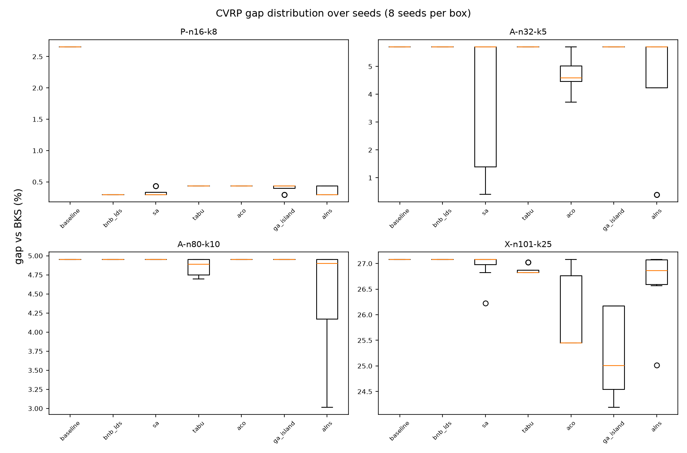

Median-level reading, which is more honest than best-level:

- **P-n16-k8**: everything beats the baseline on every seed; B&B/LDS is
  the most robust of all (0.30% on all 8 seeds — it is deterministic), and
  SA/ALNS have medians at 0.30% with occasional 0.43% seeds.
- **A-n32-k5**: the headline 0.39–0.41% results of ALNS and SA are
  **seed-sensitive** — their medians sit at the baseline 5.70%, meaning
  most seeds do not escape it. ACO is quietly the most consistent improver
  there (median 4.58%).
- **A-n80-k10**: ALNS improves on most seeds (median 4.90% in this
  pre-advanced study); Tabu improves slightly and consistently (median
  4.89%); everything else sits on the baseline — the advanced pass later
  moved GA off the baseline here.
- **X-n101-k25**: GA-Island is the most robust improver (median 25.01% in
  this study); ALNS helps on some seeds only (median 26.86%).

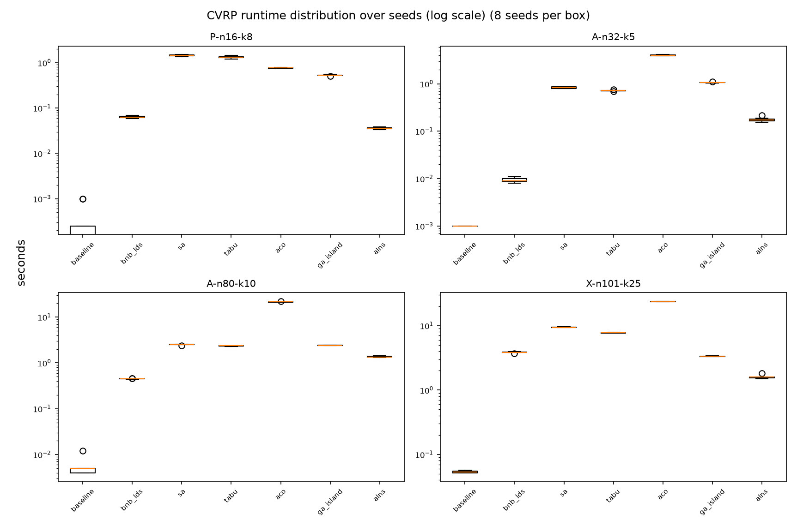

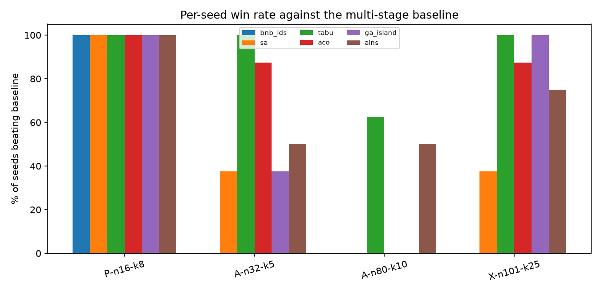

The win-rate chart summarizes the same story: on the small instance every
method wins every seed; on the tighter instances only some methods win
reliably. With 8 seeds these are descriptive statistics — no significance
test is claimed — but they make one thing clear that the best-value tables
cannot: ALNS's advantage is broad but not uniform, and some of the tuned
wins (especially on A-n32-k5) depend on the seed.

### 4.4 Advanced local-search impact (Stage 11)

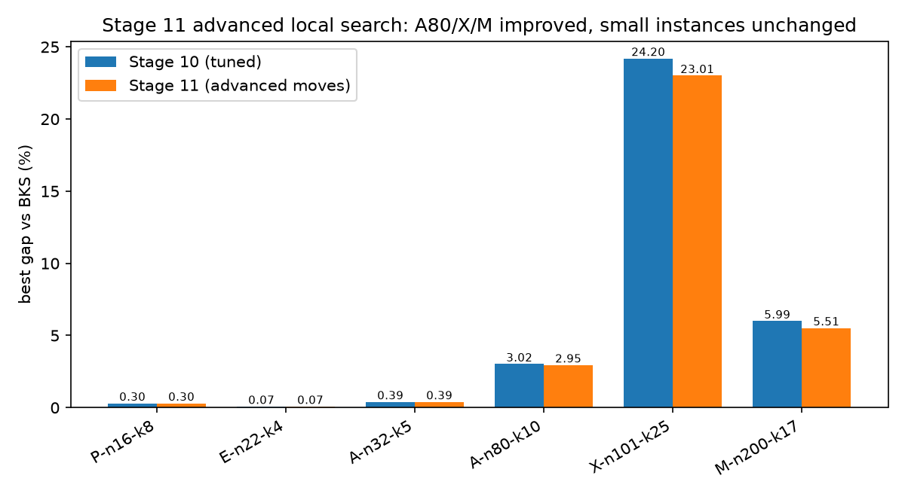

The advanced moves were validated on scaled budgets before acceptance and
then confirmed by the full final rerun. Against the previous committed
final results, the project-best gaps moved as follows:

| instance | before advanced | after advanced | change |
| --- | --- | --- | --- |
| A-n80-k10 | 3.0168% | 2.9466% | −0.07 |
| X-n101-k25 | 24.1950% | 23.0063% | −1.19 |
| M-n200-k17 | 5.9946% | 5.5139% | −0.48 |
| P-n16-k8 / E-n22-k4 / A-n32-k5 | — | — | unchanged (gate off) |

There are no project-best regressions. GA-Island gained the most: its
memetic polish improved all three gated instances (A-n80 4.95→4.66,
X-n101 24.20→23.01, M-n200 8.43→8.01) and it now beats the baseline on
6/6. ALNS improved on A-n80-k10 (3.02→2.95) and M-n200-k17 (5.99→5.51),
but its enhanced variant **regressed on X-n101-k25 (25.01→25.88)** — the
intensification restarts the search from polished bests, and on this
extremely tight instance that particular trajectory change hurt. The
regression is contained (the X project-best still improved through GA) and
reported rather than tuned away. To be clear, X-n101-k25 is not solved:
23.01% remains a large gap, for the capacity-packing reasons in the note
below.

Honest note on X-n101-k25: its total demand is 5147 while the total fleet
capacity is 25 × 206 = 5150 — only 3 units of slack over 25 routes, so
almost every route must be loaded completely full. Clarke-Wright needed 28
routes there, and a subset-sum packing repair (Section 5) was required just
to reach feasibility. That packing ignores geometry, and with nearly zero
capacity slack the usual local moves (relocate, cross-route swap) are
almost always capacity-infeasible, so the metaheuristics could barely
improve the start. The advanced inter-route moves recovered some of it,
but the remaining 23.01% gap is real and reported as such.

## 5. Multi-stage CVRP Heuristic

The baseline heuristic runs in five stages:

1. **Construction** with Clarke-Wright savings (merge route ends by
   descending saving under the capacity limit).
2. **2-opt** inside each route (reverse inner segments while improving).
3. **Relocate** between routes (move single customers while improving).
4. **Vehicle-count repair**: first empty surplus routes and reinsert their
   customers at cheapest feasible positions; if that fails, deterministic
   rebuilds (cheapest insertion, best-fit packing, sweep by polar angle);
   as a last resort a subset-sum packing that fills vehicles one at a time
   as full as possible over the integer demands — this is what makes
   X-n101-k25 feasible.
5. **Final validation** — a failed repair is returned as feasible=False
   with errors, never hidden.

Why the repair stage was necessary: Clarke-Wright merges routes only while
the merge is profitable, so on instances with a tight fleet it can stop
with more routes than vehicles exist. This actually happened twice in the
final runs — P-n16-k8 (9 routes for 8 vehicles) and X-n101-k25 (28 routes
for 25). Without the repair, every algorithm that starts from the baseline
would inherit an infeasible incumbent, which is exactly what the first
final run showed before stages 8-B2/9-B2. The subset-sum packing below is
the piece that finally made X-n101-k25 feasible:

The idea is simple to state: when total demand almost equals total fleet
capacity, almost every vehicle must leave completely full, so the repair
fills vehicles one at a time with a subset of customers whose demands sum
as close to the capacity as possible (a small dynamic-programming table
over the integer demands), with a lower bound making sure the remaining
customers still fit into the remaining vehicles.

Complexity: everything here is heuristic, not exact. One 2-opt pass over a
route of length L evaluates O(L²) candidate reversals; since the Stage 11
performance pass each candidate is priced in O(1) from its four changed
edges (delta = d[a][c] + d[b][d] − d[a][b] − d[c][d]) instead of
recomputing the whole route, which made the pass 7–136× faster
(route length 10–200 in the microbenchmark) while producing byte-identical
routes. A NumPy distance matrix was also benchmarked and rejected: scalar
indexing into an ndarray inside these Python loops measured about 4×
slower than plain lists. The relocate pass scans all customer/position
pairs, roughly O(n²) per pass, and can optionally be restricted to
k-nearest candidate lists. The repair adds packing work (the subset-sum
table is O(n · capacity) per vehicle) but guarantees the route count fits
the fleet, which turned out to be essential on two of the six official
instances.

## 6. CVRP Algorithms

All six start from the multi-stage baseline solution, share one random
relocate/swap/2-opt neighborhood where applicable, and were run with the
same per-instance budget and timeout for a fair comparison.

### 6.1 Simulated Annealing

Full solutions as states; one random neighbor per iteration; accept
improvements always and worse candidates with probability exp(-delta/T).
The first run used an untuned schedule (T₀=100, cooling 0.995, iterations =
plan budget) and mostly stayed near the baseline (mean best gap 8.50%).
The tuning pass exploited how cheap one SA iteration is compared with the
other methods: 50× more iterations, cooling 0.9995 and T₀=500 — still well
inside the shared per-instance timeout. That alone dropped SA's mean best
gap to 6.74% and made it the best method on P-n16-k8 (0.30%) and E-n22-k4
(0.07%). It still cannot beat the baseline on A-n80-k10 or M-n200-k17.

### 6.2 Tabu Search

Samples 40 candidates per iteration from the shared neighborhood, forbids
recently visited solutions via a customer-sequence signature (FIFO tenure
30), with aspiration on a new global best. Tied for the best P-n16-k8
result (0.43%) and was solid on the small instances; mean gap 8.12%.

### 6.3 Ant Colony Optimization

Ants build routes customer by customer with probability proportional to
pheromone^α · (1/distance)^β under the capacity limit, light 2-opt per ant,
evaporation plus deposits on the iteration and global best. ACO produced
the best feasible X-n101-k25 result of the first full run (25.45%, since
surpassed by the tuned GA) — its constructive nature
sidesteps the frozen-local-moves problem there — at the price of the highest
runtime (mean 32.8 s per run).

### 6.4 GA Island Model

Giant-tour chromosomes (customer permutations) split into routes by a
capacity-aware scan; OX crossover, swap/inversion mutation, tournament
selection, elitism 1; two islands with ring migration every 20 generations.
The tuned final settings raise the population from 12 to 30 and the
mutation rate from 0.15 to 0.3 (tuning also exposed and fixed an
initial-population bug that looped forever when the population was larger
than the number of distinct permutations). Stage 11 added a size-gated
memetic step: every 10 generations the best solution is polished with the
advanced inter-route pass and its chromosome is reinjected into island 0.
Result: mean best gap 6.96%, beats the baseline on 6/6 instances, holds
the overall best X-n101-k25 result (23.01%), and finally moved off the
baseline on A-n80-k10 (4.66%).

### 6.5 ALNS

Destroy operators and repair operators chosen by adaptive weights, with
simulated-annealing acceptance. The basic pool is random/worst removal plus
greedy/regret-2 insertion; the enhanced pool adds Shaw-style related
removal, full-route removal, segment removal and regret-3 insertion. The
final rerun executed both variants on every instance, and the reported
"alns" result follows the rule declared before the rerun: enhanced
everywhere except M-n200-k17, where validation had shown a +1.02%
regression, so the basic variant is used there. Stage 11 added a
size-gated intensification: when ALNS finds a new best on an instance with
at least 60 customers, the best is polished with the advanced inter-route
pass (relocate/swap/Or-opt/2-opt*, candidate lists k=10) and the search
continues from it, plus one final polish before returning. With that
policy ALNS remains the strongest method overall: lowest mean best gap
(5.85%), beats the baseline on 6/6 instances, and holds the best result on
A-n32-k5 (0.39%), A-n80-k10 (2.95%) and M-n200-k17 (5.51%) at a moderate
runtime. Its one disclosed weak spot: the intensification worsened the
enhanced variant's X-n101-k25 trajectory (25.01→25.88, Section 4.4).

### 6.6 Branch-and-Bound / LDS

A time-limited search over customer insertion decisions (hardest customers
first), where taking the k-th cheapest insertion costs k discrepancy, with
a partial-cost bound against the incumbent. With the original shallow
budget (discrepancy 3) it never beat its starting incumbent anywhere. The
final version adds a **small-instance mode**: instances with at most 25
customers get discrepancy 15 and a 2M-node cap (still timeout-capped,
still falling back to the incumbent). Measured effect: P-n16-k8 improves
from 2.65% to 0.30% in ~0.03 s and E-n22-k4 from 3.34% to 0.07% in ~1.1 s
— both tie the best results any metaheuristic found, and being a
deterministic search, it hits them on every seed. The same depth was
tested on A-n32-k5 (31 customers, depth 12, 8 s) without any improvement,
so the threshold honestly stops at 25 customers; on the four larger
instances B&B/LDS still returns its incumbent (overall mean gap 7.77%,
beating the baseline on 2/6). It remains exact-inspired, not a full exact
solver for these sizes.

## 7. Ackley Adaptations

SA and Tabu Search are natural continuous methods here (Gaussian steps; a
tabu list of rounded points). GA-Island and ALNS operate directly on
continuous vectors (blend crossover and Gaussian mutation; dimension-wise
destroy and repair). ACO and B&B/LDS are honest discretizations (pheromone
over bins per dimension; limited-discrepancy search over bin choices) — the
canonical versions of these methods are combinatorial, and the report does
not claim otherwise. Random search is only a sanity baseline. The results
in Section 3 reflect exactly this: the methods whose adaptation points
toward the origin (ALNS's toward-zero repair, B&B/LDS's zero-first bin
order) reached it, the general-purpose ones (GA-Island, Tabu) got close,
and untuned SA performed worst.

## 8. Part B — Rush Hour with GP and GEP

A* solves 6×6 Rush Hour boards with g = number of moves and a pluggable
heuristic h. GP and GEP evolve h as expressions over three board features —
distance of the red car to the exit, number of blocking cars, number of
free exit cells — plus small constants, with protected operators
(+, -, *, /, min, max, abs, neg, log). Fitness strongly rewards solved
puzzles (10000 each) and penalizes expanded nodes, solution cost, timeouts
and node-cap hits. Every evaluation runs under the safety caps from
Section 2.3.

GP uses expression trees with subtree crossover and mutation. GEP is a
separate framework: a linear genome with a head (functions or terminals)
and a tail (terminals only), decoded as a Karva K-expression; its operators
are point mutation and one-/two-point crossover on the flat gene string.
The decoder is the heart of GEP — it reads the linear genome left to right
and attaches children level by level, ignoring leftover symbols:

### 8.1 The hard benchmark (main Part B evaluation)

The first comparison used a 4-puzzle evaluation set, and everything —
including plain manual heuristics — solved all of it with 4 expanded
nodes, so GP and GEP tied perfectly at fitness 39956. That result is kept
only as a historical smoke check; the main evaluation is a **hard Rush
Hour benchmark** of 14 puzzles committed under
`examples/rushhour_hard_eval.txt`. Every puzzle was verified with the
project parser and solved by the project A* before being committed, with
optimal solutions of 4–17 moves and measured difficulty spanning 36 to
13,243 zero-heuristic expansions.

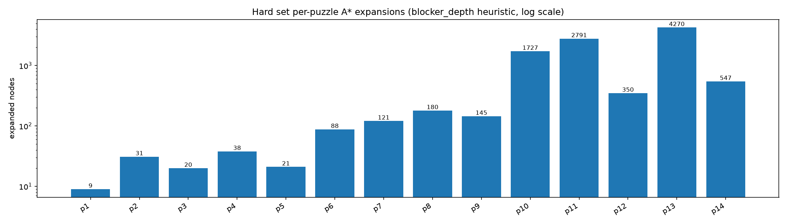

A ladder of manual heuristics anchors the comparison (identical caps for
everything: 15,000 nodes and 2 s per puzzle, 20 s total per evaluation):

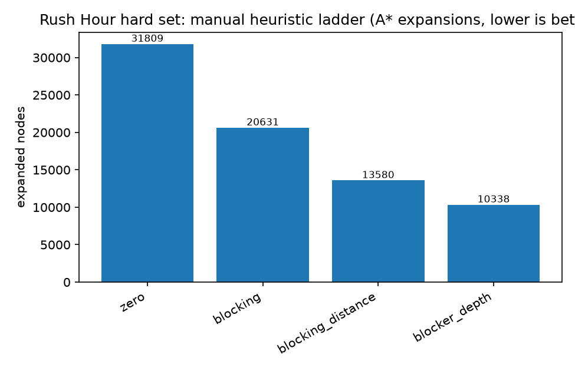

Each added ingredient pays off: zero solves only 9/14 within the caps
(31,809 expansions), blocking gets 13/14 (20,631), blocking+distance
needs 13,580, and blocker_depth — which also penalizes blockers that are
themselves stuck — needs only 10,338. That monotone ladder is what makes
the set a meaningful benchmark.

GP and GEP were then run with identical budgets (population 30, 20
generations, seeds 42–44; training on the 4 original puzzles plus the 3
easiest hard ones; evaluation on all 14):

| run | eval fitness | solved | expanded | best expression |
| --- | --- | --- | --- | --- |
| gp seed 42 | 119583 | 13/14 | 7617 | min((min(blocking, blocking) * (distance - 0)), ...) |
| gp seed 43 | **120002** | 13/14 | 7198 | (abs((blocking * (blocking * blocking))) / abs(0.5)) |
| gp seed 44 | 91200 | 11/14 | 12150 | (((distance * distance) / free) ... * (blocking / 0.5)) |
| gep seed 42 | 102807 | 12/14 | 12533 | (max(max(1, 0), 5) - ((free - distance) * 2)) |
| gep seed 43 | **119985** | 13/14 | 7215 | max((5 * blocking), ((1 + distance) * blocking)) |
| gep seed 44 | 101946 | 12/14 | 13384 | (blocking + (distance / (abs(blocking) - free))) |
| manual blocker_depth | 116852 | 13/14 | 10338 | (hand-written) |

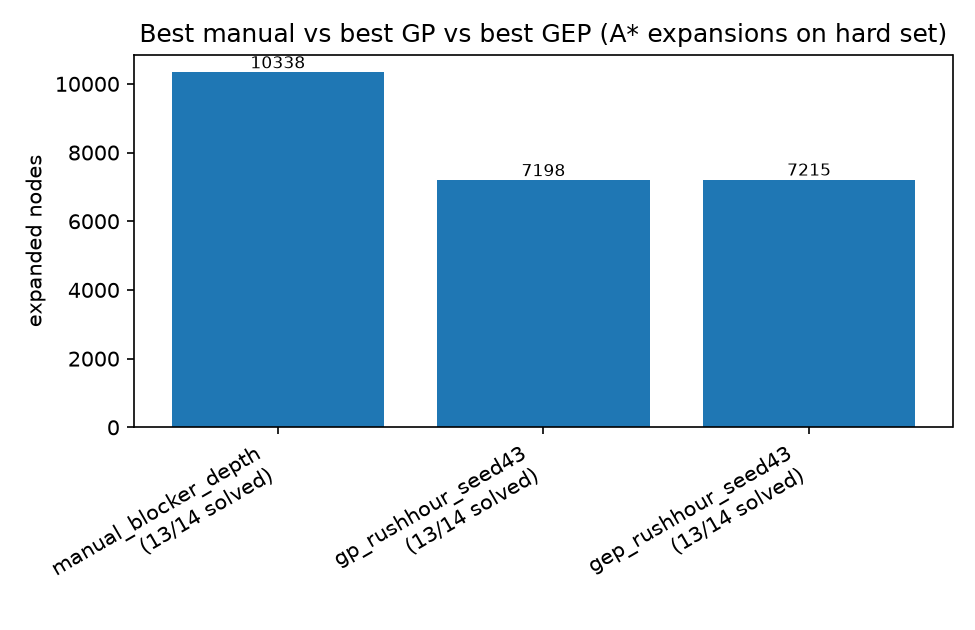

**The core finding:** the best evolved heuristics from both frameworks
beat the strongest manual heuristic — GP 120002 and GEP 119985 vs
blocker_depth 116852 — solving the same 13/14 puzzles with about 30% fewer
A* expansions (≈7,200 vs 10,338). Evolution genuinely found better
guidance than the hand-written baselines here.

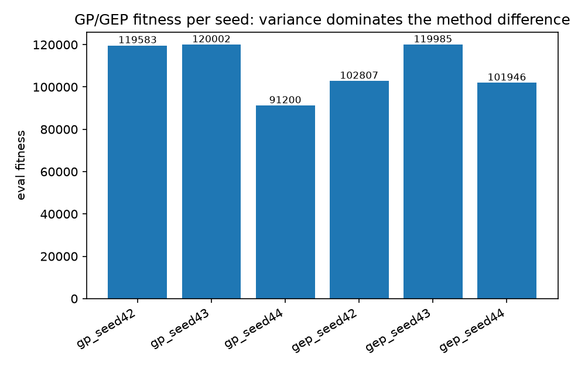

**GP vs GEP stays an honest tie at the top:** 120002 vs 119985 is a
0.01% difference, while the per-seed spread within each method is ~30,000
fitness points (GP's worst seed drops to 91200, GEP's to 101946). Seed
variance dominates the method difference, so no winner is declared.
Expression diversity is 1.00 for both. Notably, no run solves 14/14 under
the caps — the hardest puzzle needs more than the 15,000-node budget with
any evolved or manual guide — which means the benchmark still has headroom
and the results are not saturated like the old 4-puzzle set. (Numbers this
close to the time caps can shift by a fraction of a percent between runs;
the ordering has been stable.)

### 8.2 Bonus: direct GP/GEP Rush Hour planner without A*

The main Part B method evolves heuristics that are used *inside* A*. The
assignment's bonus asks the opposite question: can GP/GEP act directly as
the planner, with no A* at all? This subsection is that exploratory bonus —
it does not replace the A*-guided result above.

**How the direct planner works.** A policy expression is rolled out
greedily: at each state the planner enumerates all legal moves, scores
every move with the evolved expression (lower = better), applies the best
one with a deterministic tie-break, and stops on solved, at 120 steps, or
at a 2-second timeout. There is no open list, no f = g + h, no
backtracking — and a visited-state set makes the policy prefer moves to
unvisited states (revisits are counted and penalized in fitness). The code
is `src/rushhour/direct_planner.py`; a test suite monkeypatches the A*
solver to raise if it is ever called during direct planning.

**Move features.** Instead of the three state features the A*-heuristics
use, direct policies see eleven features of each candidate move: red-car
distance and blockers/blocker-depth/free-exit cells *after* the move, the
deltas of distance and blockers caused by the move, whether the moved
vehicle is the red car and whether it moves toward the exit, the move
length, the mobility (number of legal moves) of the resulting position,
and a visited indicator for cycle avoidance
(`src/rushhour/direct_features.py`).

**Benchmark.** Same 14 hard puzzles, seeds 42–44, population 30, 20
generations, identical rollout caps for every method. Three hand-written
direct policies run under the *same* rollout as baselines, so the
comparison is direct-vs-direct, not direct-vs-A*:

| direct method | solved (best) | notes |
| --- | --- | --- |
| random legal move | 7/14 | seeded random walk |
| greedy red-distance | 4/14 | oscillates (91 cycle fallbacks) |
| greedy blocker-depth | 9/14 | strongest manual direct policy |
| GEP direct | 9/14 (all seeds) | converges to `blocker_depth`, size 1 |
| **GP direct** | **11/14** (seeds 42, 43; mean 10.3) | composite expressions, sizes 22/10/1 |
| A*-guided evolved heuristic (reference) | 13/14 | not direct — shown for scale |

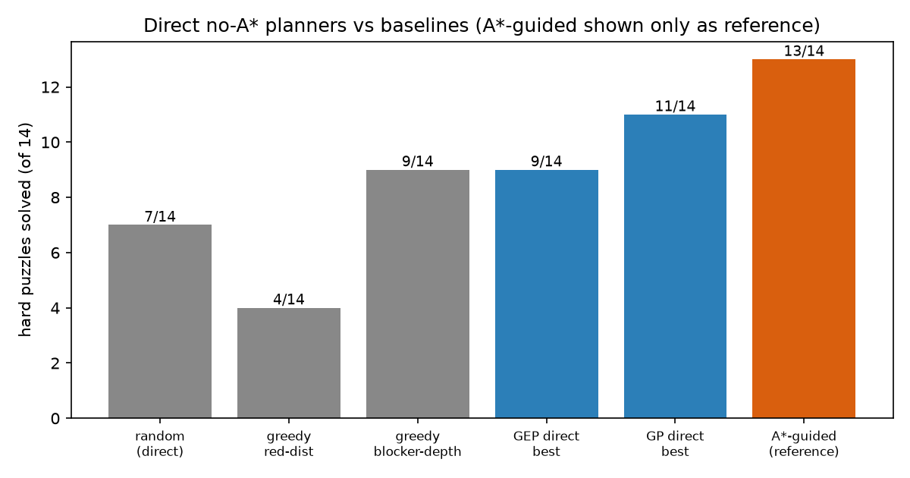

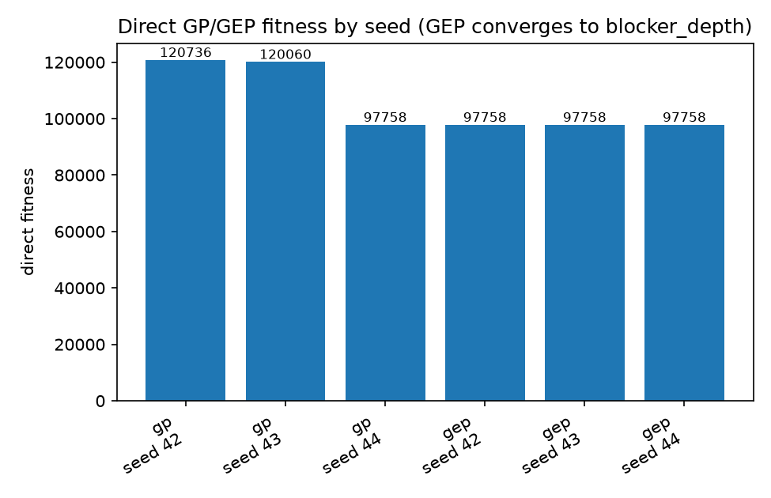

GP's best direct policies (fitness 120736 and 120060, expression diversity
0.77–0.80) combine `blocker_depth` with `mobility` and `red_distance`
terms and solve 11/14 — a real improvement over the best hand-written
direct policy (9/14). GEP is honestly less interesting here: all three
seeds converged to the single terminal `blocker_depth` (fitness 97758,
size 1), exactly rediscovering the best manual feature and tying it, never
beating it. The parsimony pressure that kept GEP compact in the A*
benchmark works against it in this richer feature space.

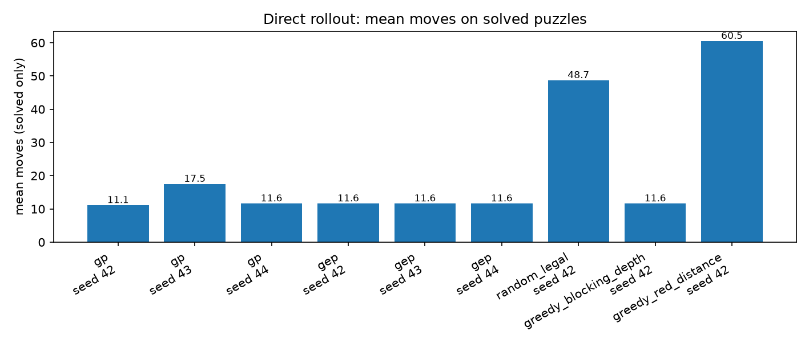

**Honest conclusion.** The A*-guided approach remains clearly stronger
(13/14 vs 11/14): A* has search memory and frontier management, while the
greedy rollout commits to one move per state and can only avoid cycles,
not recover from them. Per step, however, the direct planner is very cheap
— it scores only the current legal moves (about a dozen boards) instead of
expanding thousands of A* nodes, and solved puzzles take it 11–18 moves on
average. The bonus stands as a positive exploratory result: evolution
found a better direct policy than we could write by hand, and the
no-search planner solves 11 of 14 measured-hard puzzles — but the main
Part B result stays the A*-guided benchmark of Section 8.1.

## 9. Results

The main tables and figures are in Sections 3 (Ackley), 4 (CVRP) and 8
(GP/GEP); the committed report figures live under `report/figures/` and
small evidence snapshots under `report/evidence/`. The raw per-run rows
live under `results/final_experiments/raw/` (144 CVRP rows including both
ALNS variants, 21 Ackley rows) plus the hard Rush Hour benchmark under
`results/final_experiments/rushhour_hard/`; the aggregated tables are
under `results/final_experiments/summary/`. The execution manifest
(`final_execution_manifest.json`) records what ran, with which budgets,
the tuned settings, and the pre-declared ALNS policy.

## 10. Analysis and Discussion

- **CVRP pattern.** Gaps grow with instance size: 0.30% or less on
  P-n16-k8 and E-n22-k4, 0.39% on A-n32-k5, ~3–5.5% on A-n80-k10 and
  M-n200-k17. ALNS keeps the lowest mean best gap (5.85%) and, together
  with the advanced GA-Island, beats the baseline on all six instances.
- **What tuning and the advanced moves bought (and did not).** Tuning:
  P-n16-k8 0.43→0.30, A-n80-k10 4.03→3.02, X-n101-k25 25.45→24.20. The
  Stage 11 advanced moves then pushed the large instances further:
  A-n80-k10 →2.95, X-n101-k25 →23.01, M-n200-k17 5.99→5.51, with the
  small instances unchanged by the size gate and no project-best
  regressions. The tuned SA improvement came purely from spending its
  unused time budget on more iterations — a fairness-preserving change,
  since all methods share the same timeout. The enhanced ALNS improvement
  needed real new operators (Shaw/route/segment removal, regret-3). Its
  M-n200-k17 regression was handled by the pre-declared hybrid policy, and
  the one advanced-move regression (enhanced ALNS on X, 25.01→25.88) is
  disclosed in Section 4.4, not hidden.
- **X-n101-k25.** With 3 units of total capacity slack, feasibility is a
  bin-packing problem and single-customer local moves are nearly frozen:
  any relocate overfills a route. The Stage 11 compound moves (swap,
  Or-opt, 2-opt*) were added precisely for this and recovered about 1.2
  points through GA (24.20→23.01), but the gap stays large. Full ejection
  chains — the next escalation — stayed out of scope.
- **Ackley.** Unchanged by this stage. The warm-up separated the methods,
  but part of that separation comes from how each was adapted (Section 7).
  Untuned SA losing to random search there remains a useful reminder that
  parameter choices matter as much as the algorithm name — the CVRP side
  proved the same point in reverse when tuned SA jumped from 8.50% to
  6.74%.
- **GP vs GEP.** On the hard benchmark both frameworks beat the strongest
  manual heuristic by ~30% fewer expansions, and they remain effectively
  tied at the top (120002 vs 119985) with per-seed variance ~30,000
  fitness points — far larger than the method difference. GEP's best
  expressions stay visibly more compact. Both frameworks are genuinely
  different representations, not renames.
- **Runtime vs quality.** ALNS delivers the best average CVRP quality at
  moderate runtime; ACO remains the most expensive; tuned SA uses its
  budget instead of leaving it idle. B&B/LDS with the small-instance mode
  ties the best results on the two smallest instances almost for free, but
  spends its budget without beating the incumbent everywhere else. The
  advanced moves bought their quality at a controlled cost: mean ALNS
  runtime on M-n200-k17 stayed flat (26.9→25.4 s basic, 22.0→22.5 s
  enhanced) and GA paid about 1.5 s extra per M-n200-k17 run, because the
  delta 2-opt speedup absorbed most of the added work.
- **Seed robustness.** The 8-seed analysis (Section 4.3, measured before
  the advanced pass) shows which wins are stable: ALNS is a broad but not
  uniform improver, GA is the reliable one on X, B&B/LDS is perfectly
  stable where it works, and the A-n32-k5 headline numbers are seed-lucky
  (median = baseline). Eight seeds give a descriptive picture, not a
  statistical significance claim.
- **Limitations.** One fixed budget/timeout profile per instance, three
  seeds for the main tables (eight for the robustness section, which
  predates the advanced pass), one tuning pass validated on the same six
  instances, an advanced-move regression on one algorithm/instance pair
  (Section 4.4), a B&B/LDS that is still ineffective beyond 25 customers,
  and a 14-puzzle Rush Hour set — the comparisons hold for this setup
  only, and no claim of class-leading performance is made without an
  external comparison.

## 11. Complexity and Practical Considerations

- **Feasibility checking** is O(n) per solution and is run on every
  candidate the metaheuristics accept, plus once on every final result —
  the cost is small compared to neighborhood evaluation and it caught real
  bugs (route-count violations) that pure cost comparison would hide.
- **Neighborhood costs.** The shared relocate/swap/2-opt neighborhood costs
  O(n) per sampled neighbor (copy + cost); Tabu's 40 candidates per
  iteration make it ~40× SA per iteration, which matches the observed
  runtimes. The Stage 11 best-improvement passes (relocate, swap, Or-opt,
  2-opt*) price each candidate move in O(1) from its changed edges and can
  prune their scans with k-nearest candidate lists; both the exact and the
  pruned neighborhoods are kept available, and k = 10 was accepted only
  after producing identical solutions to the full scan in validation.
- **Stochastic variance.** Three seeds per configuration; the summary CSVs
  report mean and standard deviation. The seeds are fixed in the plan, so
  every row can be regenerated exactly.
- **Timeouts and fairness.** All algorithms get the same timeout on the
  same instance, so slower-per-iteration methods are not silently given
  more work. Budgets differ per algorithm in meaning (iterations vs
  generations vs nodes), which is why the timeout is the binding fairness
  control on the large instances.
- **No optimality claims.** Everything here is heuristic or time-limited;
  the gaps against BKS quantify exactly how far the results are from the
  best known solutions.

## 12. Use of AI Tools

AI tools were used as coding and debugging assistants during the project.
The final code and this report were reviewed and understood by the student.
Any generated code was tested and adjusted through the project's test suite
and staged workflow.

## 13. Reproducibility

- Python 3.12.3, dependencies via `pip install -r requirements.txt`
  (numpy, matplotlib, pandas, pytest).
- Place the six official CVRPLIB files under `data/official_cvrp/` and
  verify with `python scripts/check_official_cvrp_data.py --strict`.
- Smoke check: `python scripts/run_smoke_suite.py --output-dir results/smoke_suite`
- Print/validate the final plan:
  `python scripts/print_final_experiment_plan.py --require-official-data`
- Full final tuned run (resumable):
  `python scripts/run_final_experiments.py --tuned-cvrp configs/tuned_cvrp_settings.json --rushhour-hard configs/rushhour_hard_benchmark.json`
- Hard Rush Hour benchmark on its own:
  `python scripts/run_gp_gep_hard_benchmark.py --puzzles examples/rushhour_hard_eval.txt --seeds 42 43 44`
- Direct no-A* planner bonus (Section 8.2):
  `python scripts/run_gp_gep_direct_planner.py --seeds 42 43 44 --population 30 --generations 20`
  (evidence snapshots: `report/evidence/direct_*.csv` and
  `direct_planner_manifest.json`)
- Old-vs-new comparison: `python scripts/extract_final_results_v3.py`
  (its output, `final_v3_summary.txt`, is the current final comparison
  summary and a copy is committed under `report/evidence/`)
- Evidence snapshots: `python scripts/refresh_report_evidence.py` copies
  and derives the small committed files under `report/evidence/` from the
  local final results
- Report figures: `python scripts/generate_report_figures.py`, plus
  `python scripts/generate_route_visualizations.py` and
  `python scripts/generate_convergence_figures.py`, then
  `python scripts/export_report_pdf.py` for this PDF
- Audit: `python scripts/audit_submission.py --check-results --check-pdf`
- Report facts: `python scripts/extract_report_numbers.py`
- Small evidence snapshots of the result files cited by this report are
  committed under `report/evidence/` (summaries, GP/GEP runs, execution
  manifest). The full generated outputs stay under
  `results/final_experiments/` locally and are not committed to Git, and
  the official `.vrp` files are user-provided data that is also kept out of
  the repository.

The final runner is what makes the experiments reproducible in practice:
it validates the plan and the official data before anything runs, executes
each part through the same Python functions the tests use, writes one CSV
row per run with its seed/budget/timeout, and skips already-finished raw
files — when the vehicle-count repair changed, only X-n101-k25 had to be
rerun while the other five instances were reused untouched:

The submission audit output below is the real terminal output of the audit
script on this repository — around 50 checks covering files, row counts,
feasibility, report-vs-evidence consistency, and forbidden artifacts:

And the extracted report numbers, printed straight from the final CSVs
(the same numbers used in the tables above):

## 14. Conclusion

The implementation covers everything the assignment asks for: the six
required search algorithms on both the Ackley warm-up and the six official
CVRP instances, an explicit multi-stage CVRP heuristic with an honest
feasibility-repair story, and separate GP and GEP frameworks for evolving
Rush Hour heuristics evaluated through A*. The final rerun (144 CVRP rows,
all feasible), which combines the tuned settings with the Stage 11
advanced local-search moves, holds the project's best gaps: 0.07–0.39% on
the three small instances, 2.95% on A-n80-k10, 5.51% on M-n200-k17, and
23.01% on the capacity-tight X-n101-k25 — still large and reported as a
real limitation rather than smoothed over, along with the one
algorithm-level regression the advanced pass caused (enhanced ALNS on X).
ALNS with the pre-declared hybrid policy keeps the lowest mean gap and
beats the multi-stage baseline on all six instances, now joined by the
memetic GA-Island; B&B/LDS, after gaining a small-instance deep-search
mode, ties the best known project results on the two smallest instances
but still returns its incumbent on the four larger ones, which is stated
as-is. On Ackley (unchanged), the adapted ALNS
and B&B/LDS reached the optimum while untuned SA did not beat random
search — a lesson the CVRP tuning then confirmed from the other direction.
On the hard Rush Hour benchmark, both evolved frameworks beat the
strongest manual heuristic by about 30% fewer A* expansions, while GP and
GEP themselves remain honestly tied at the top with seed variance
dominating. The optional no-A* bonus adds one more genuine result: GP
evolved as a direct greedy planner solves 11/14 hard puzzles — beating the
best hand-written direct policy (9/14) — while remaining honestly weaker
than the A*-guided search (13/14). The main open improvements are full
ejection chains for the
capacity-tight CVRP instances (the Stage 11 swap/Or-opt/2-opt* moves
recovered only part of the X-n101-k25 gap), a stronger bound to extend
B&B/LDS beyond 25 customers, and pushing the hard Rush Hour set until the
frameworks separate.
